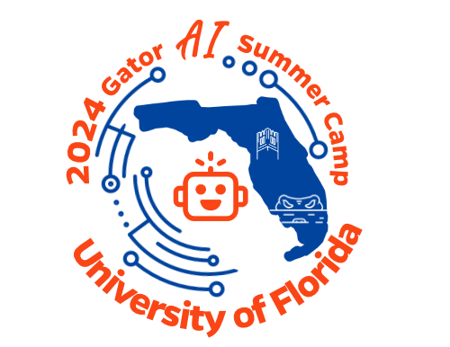

# Gator AI Summer Camp 2024 Applied Exercise

This repository is the exercises that will lead participants in the 2024 Gator AI Summer Camp on an applied AI experience.

Participants will get experience with image classification and facial recognition models, unsupervised learning, and more. These notebooks are not intended to contain all the information and will be used in a classroom setting, with instructors leading the participants through the exercises and discussing what is happening at each step, providing important AI ethics framing and more.
 
Rough overview of the experience:
1. Train an image classification model to classify emotions from images of faces. 
2. Collect data for AI applications, including additional images of a new emotion and data to link emotions to songs.
3. Train an unsupervised model on unlabeled music metadata to cluster songs with similar features.
4. Create a program that takes video input and feeds frames to the emotion recognition model. The detected emotion is used to select a sample song identified with that emotion and then that is used to find another song from the same cluster. 
5. Lastly, the Spotify API is used to play the selected song. 
